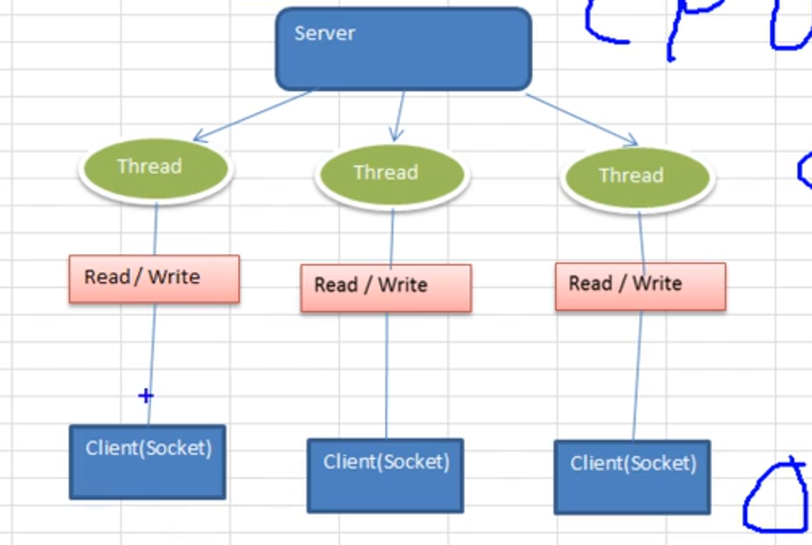
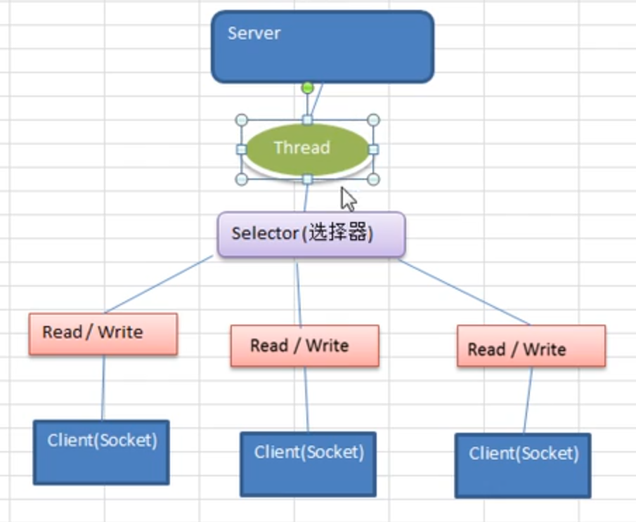
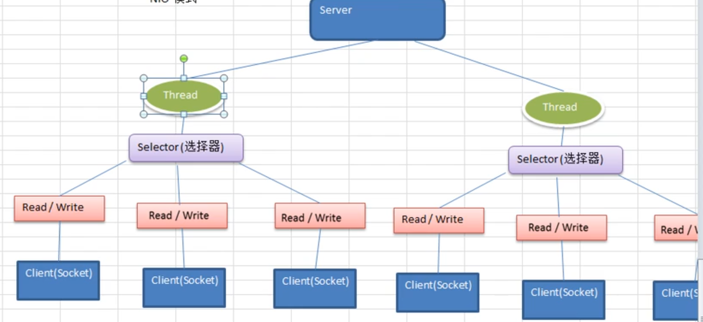
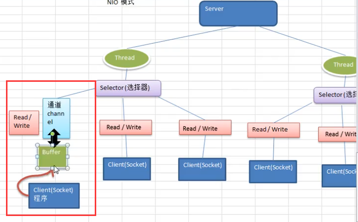

BIO模式(同步阻塞)：一个客户端向服务器连接，连接会对客户端分配一个线程进行连接，做IO的read/write.

缺点：在高并发的情况下，多个客户端都需要服务器建立连接，服务器压力很大。而且还会阻塞。有些建立的连接可能什么事情都没有做，是空闲的状态，但是还有很多客户端等待建立连接。




NIO(同步非阻塞): 对BIO的改良：一个线程处理多个请求或者多个客户端连接。客户端发送的连接请求都会注册到多路复用(简单理解selector选择器)上。

​	一个线程会维护一个Selector，将有事件的通道会做轮询选择。



>netty简单示意图
>
>

BIO例子

```java
public static void main(String[] args) throws IOException {
        ExecutorService executorService = Executors.newCachedThreadPool();
        ServerSocket socket = new ServerSocket(6666);
        System.out.println("server start....");
        while (true) {
            System.out.println("听说在这里阻塞....");
            final Socket accept = socket.accept();
            System.out.println("启动到一个线程：ThreadId: " + Thread.currentThread().getId()
                    + "ThreadName: " + Thread.currentThread().getName() + "创建一个连接");
            executorService.execute(new Runnable() {
                @Override
                public void run() {
                    handler(accept);
                }
            });
        }
    }

    public static void handler(Socket socket) {
        byte[] bytes = new byte[1024];
        try {
            InputStream inputStream = socket.getInputStream();
            while (true) {
                System.out.println("听说在这里阻塞2222....");
                int read = inputStream.read(bytes);
                if (read == -1) {
                    break;
                }
                String result = new String(bytes, 0, read);
                System.out.println("ThreadId: " + Thread.currentThread().getId() + "ThreadName: "
                        + Thread.currentThread().getName() +
                        " result: " + result);
            }
        } catch (IOException e) {
            e.printStackTrace();
        } finally {
            try {
                socket.close();
            } catch (IOException e) {
                e.printStackTrace();
            }
        }
    }
```


#### NIO三大核心： Channel(通道)，Buffer(缓冲区)，Selector(选择器)

>  jdk1.4之后才有NIO，在1.7后才有AIO
>
> 
>
> NIO是面向缓冲区、或者面向块编程的，数据读取到一个它稍后处理的缓冲区，需要时可在缓冲区前后移动，这就增加了处理过程中的灵活性，使用它可以提供非阻塞的高伸缩性网络。
>
>  
>
> ByteBuffer可以直接映射操作系统，减少程序缓冲区和内核缓冲区拷贝

NIO例子

```

```


