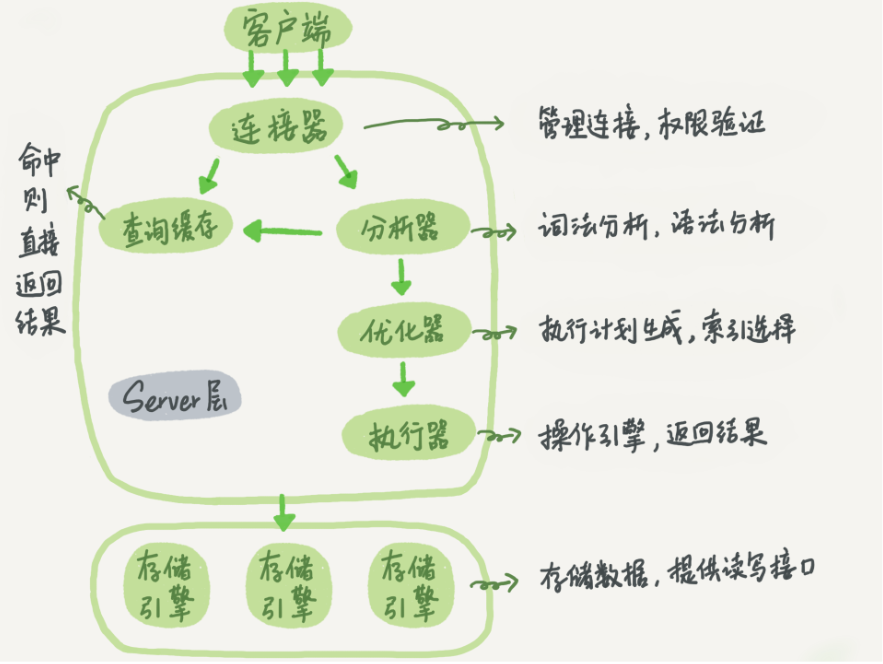
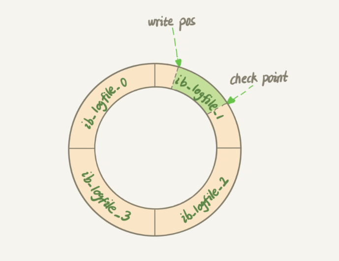
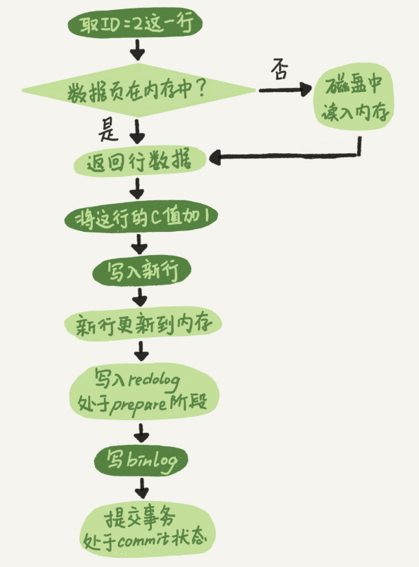

#### mysql的基础架构

##### 一条查询语句的基础流程

Mysql分为server层和存储引起层。

- server层包括连接器、查询缓存、分析器、优化器、执行器等，涵盖大多数的mysql核心服务功能，已经各种内置函数也在这一层。所有垮存储引擎的触发器也是在这一层实现的比如：存储过程、触发器、视图等。
- 存储引擎层负责数据的存储和提取，其架构是插件式的。支持的引擎 InnoDB、MYISAM、Memory。默认是InnoDB引擎。

一条sql基本的执行流程：

- 第一步，首先连接到数据库。这一过程由连接器完成，会在创建连接的时候，获取权限、维持和管理连接，核实输入的用户密码，如果长时间不操作，连接器会自动断开连接。默认是8h。

- 连接建立完成后，执行sql查询语句。首先到缓存中查看，之前是不是执行过这条语句，如果执行过，他会直接取出来，那么到这儿就结束了。

  > 但是大多数情况都不会去使用查询缓存。因为 如果一个表更新，这个表上所有查询缓存的数据都会被清空。如果你刚把缓存存起来，已更新，就全没了，维护太难，命中太低。以至于后面，查询缓存都慢慢去掉了

- 如果没有命中缓存，那么久开始执行sql语句了。然后到分析器，分析器首先做"词法分析"。他会识别你sql的字符串是什么，代表是什么。

  > 如果提醒 你有sql错误，一般就是在这一步提出来的。
  >
  > You have an error in your SQL

- 经过分析器后，到优化器，优化器在表有多个索引的时候，决定使用哪个索引；或者一个语句有多个表join关联的时候，觉得各个表的连接顺序。优化器是选择执行效率最优的方案。

  > 有时候分析器会判断错误

- 确定查询方案后，开始执行sql。开始执行的时候，会先判断该用户有没有对这个表的执行 “查询/更新”权限。如果没有，会返回没有权限的错误，没有就开始执行。

  > 查询的时候，会查找第一条满足条件的一行，然后向下取，知道第一条不满足条件的一行为止。




##### 日志系统--一条更新语句的流程

 更新的基础流程和查询的流程差不多，都会经历连接器、分析器、优化器、执行器。但是与查询流程不一样的是，更新流程还会涉及两个重要的日志模块：

> 为什么要使用redolog binlog
>
> ​	mysql有个问题，如果每一次的更新操作都要及时的写进磁盘，然后磁盘也要先找到那条记录，在更新，整个过程的IO成本就很高。于是Mysql使用WAL技术改变这种状态。WAL技术就是 write Ahead Logging 先写日志，再写磁盘。

- redo log : 先记录最先的操作，在两种情况移到binlog，一个是系统空闲的时候自动移动，一个是如果redolog要满了，自动移动。
- binlog : 所有的操作记录。

> redo log : 是InnoDb独有的日志。可以配置为一组4个文件，每个文件大小是1GB。从头写，写到末尾就回到开头循环写



> binlog ：也叫归档日志，可以适用于各种引擎。会出现两个日志，是因为，InnoDB是后来才进入mysql的。


**binlog和redolog的区别**

* redo log 是InnoDB引擎独有，binlog是mysql的server层实现，所有引擎都可以使用。
* redo log 是物理日志，记录“在某个数据页上做了什么修改”；binlog 是逻辑日志，记录的是这个语句的原始逻辑，比如“给ID=2 这一行的c字段加1”
* redo log 是循环写，空间固定。binlog是追加写


**一条更新的执行流程** 比如更新id=2的某个值+1

* 执行器找到引擎取ID=2 的这一行。ID是主键，索引直接用树搜索到这一行，如果ID=2这一行所在的数据页本就就在内存中，就直接返回给执行器；不然就从磁盘中加载。
* 执行器拿到引擎给的数据，+1后，得到新的一行数据，调用引擎接口写入这一行新数据。
* 引擎更新到内存中，同时将更新记录写到 redo log 中，此时 redo log 处于prepare状态。然后告知执行器完成了，随时可以提交事务。
* 执行器生产的这个操作bin log 并把binlog写入到磁盘。
* 执行器调用提交事务的接口，吧redo log 改成commit状态，更新完成。



**redo log 拆成两部分 prepare commit ,这是两阶段提交**


#### 事务隔离

​	事务就是要求一组操作，要么都成功，要么都失败。事务是再存储引擎层的。InnoDB就支持事务，然而MyISAM就不支持事务。也就是MyISAM被代替的原因


##### 隔离性和隔离级别

ACID（原子性、一致性、隔离性、持久性）。

当数据库有多个事务同事执行的时候，可能出现脏读、不可重复读、幻读等问题。为了解决这些问题，就出现了“隔离级别”的概念。

> 隔离级别越高。效率就会越低。因此很多时候在二者之间寻找平衡点。

SQL标准的事务隔离级别：读未提交、读提交、可重复读、串行化。

读未提交：一个事务还没有提交的时候，他做的变更可以被别的事务看到

读提交：一个事务提交后，他做的变更才能被其他事务看到。

可重复读：一个事务执行过程中看到的数据，总是跟这个事务启动时看到的数据是一致的。在可重复隔离级别下，未提交更对其他事务也是不可见的。

串行化：就是加锁，读锁，写锁。


#### 索引

**基于主键索引和普通索引的区别**

主键查询的话，直接查找主键索引树。

普通索引的话，会先找到普通索引树，然后找到id，再到Id索引树查找到对应的最红结果(回表)。


**怎么建立索引**

看where查询中高频字段。

select中的能够减少回表的复合索引。


**最左前缀原则**

复合索引(name,age)包含两个索引：(name，age)，(name).


**两阶段锁协议**

InnoDB，行锁是需要的时候加上，但不是在不需要就立即释放，而是是等到事务结束时才释放。


#### 普通索引和唯一索引的选择

- 前提业务能够保证字段是唯一的地方能够保证唯一

**查询过程**

假如执行

```sql
select id form TR where k=5
```

这个查询在索引树上去寻找，从b+树的树根开始，然后到叶子节点：

> ​		如果是普通索引，找到  k=5 这个位置，然后还会向下判断一个位置，遇到第一个不满足  k =5 的条件再结束。
>
> ​		如果是唯一索引，因为索引定义了唯一性，查找到第一个满足条件后，就会停止继续检索

<font color="blue">其实这两者的性能差别并不是太大，相当来说是微乎其微。因为普通索引来说，也就是需要多做一次查找和判断下一条记录的操作，只需要一次指针寻找和一次计算 </font>  (<font color="red"> 尽管有可能  k = 5 这一条数据恰好在数据页最后一个，判断下一个需要将数据页从磁盘中重新加载到内存 这一点的消耗也是非常少的，并且一个数据页大小默认16k，对于整形字段，一个数据页可以放近千个key，所以总体上说性能影响不大</font>) 。


**更新过程**

> <font color="orange">change buffer:    </font>                                                                                
>
>          <font color="orange"> 当需要更新一个数据页的时候，这个数据页在内存中就直接更新，如果数据页没有在内存中的话，在不影响数据一致性的前提下，InooB将这些操作缓存在 change buffer 中，这样就不需要从磁盘中读入内存，将下一次要查询的时候或者change buffer 的定时器，会将change buffer数据merge到内存，然后执行change buffer中与这个页有关的操作。</font>
>
> ​		change buffer 实际上是持久化数据，在内存中有拷贝，也会被写入磁盘上。

如果更新记录在 change buffer 中，减少读磁盘，语句的执行速度得到明显的提升，而且，数据读入内存占用buffer pool ，这种方式还能避免占用内存，提高内存效率。

​		在唯一索引下，更新操作，首先判断这个操作是否违反唯一性约束。比如插入一个数值，需要判断整个表中是否已经存在，如果不存在就插入，反之。整个表的数据不一定都在内存中，这里的判断唯一性就涉及到从磁盘读入内存的开销。

​		在普通索引下，更新操作，不需要考虑太多东西，所以可以直接使用 change buffer，提升效率。


**关于索引的选择 **

​	所有的更新后面都马上伴随着对这个记录的查询，那么你应该关闭 change buffer, 其他情况下 change buffer 都能提升更新性能。

​	如果是在归档数据库中，建议将唯一索引改成普通索引。比如 order_travel_info 的数据移动到 order_history_info 中，写到history中肯定是没有唯一键冲突，提高效率的话，可以将表中的唯一索引改成普通索引。

> 如果需要使用唯一索引的地方，不使用。 墨菲定律回来搞你的


#### Mysql选错索引

- 如果由于索引统计信息不准确导致的问题，可以使用analyze table来解决。(我怎么知道是因为这个原因导致查询效率低下，要不写一个脚本每天定时执行一下？)
-  其他优化器误判的情况，你可以在应用端用 force index 来强行指定索引，也可以通过修改语句来引导优化器，还可以通过增加或者删除索引来绕过这个问题 

##### 为什么Mysql会抖一下

- redo log写满了要flush脏页。
- 内存不够用，需要将脏页写到磁盘

<font color="red">解决方案：设置innodb_io_capacity告诉mysql当前机器的io性能，mysql就会真正全力的刷脏页</font>

##### 为什么删除表数据-空间占用还是没有变化

innodb_file_per_table： OFF表示：表的数据放在系统的共享表空间，也就是跟数据字典放在一起。ON表示：每个InnoDb的表数据是存储在一个.ibd为后缀的文件中。

> 无论是那个版本都要将这个值设置为ON，因为，一个表单存储为一个文件更容易管理，而是你不需要这个表时候，直接删除即可。<font color="red">如果放在共享表空间中，即使表删除了，空间也不会回收的。</font>

innoDB的表数据都是在B+树结构组织的，所以尽管删除了某条数据，但是并不是真正的删除。只是标记删除，因为后续的新增啥的操作可能会复用这个节点。这些标记但是没有真正删除的空间就形成了空洞

> 除了删除会造成空洞，更新和插入也会造成空洞。插入有可能引起页数据分裂，最后一个节点后的空间并没有被使用。更新其实就是删除旧数据，更新新数据，也会造成空洞

**怎么解决**

<font color="red">重建表</font>

eg: alter table A engine=InnoDB 


#### count(*)

count(主键Id),count(1),count(字段)，count(*)

效率：count(*) >= count(1) > count(主键)>count(字段)

- count(*)专门做了优化，统计的时候，选择最小的索引树进行统计，也不会将值取出来。只是遇到不为NULL就+1
- count(1)会遍历所有的数据，但是不会将其取出来，直接+1
- count(主键)会遍历主键索引树，但是会涉及字段数据的加载问题。


#### order by 执行流程

流程：

- 初始化sort_buffer
- 遍历对应的索引树，找到复合条件的字段找到对应的Id
- 通过Id回表，找到需要的所有数据，并且添加到sort_buffer中
- 循环上面的操作，直到不满足条件为止。
- 在内存中执行快速排序

> 全字段排序 vs rowId排序
>
> rowId排序： 每次排序都去磁盘找到对应的其他字段数据
>
> 全字段排序：直接将字段数据都添加到sort_buffder中
>
>  
>
> 在内存足够用的情况，会全字段排序，如果内存不够用选择rowId排序


