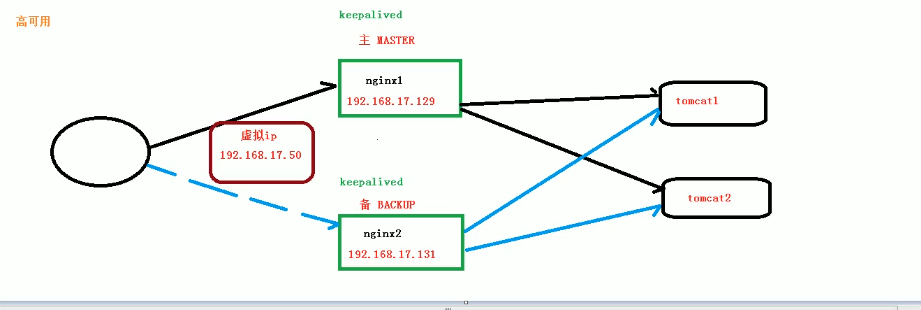

### nginx概要

#### nginx

​		高性能，低消耗的 Http反向代理web服务器。优点：占用内存少，并发能力强。 专门为性能优化并发，注重效率，能承受高负载的能力，5W并发连接数

​		 支持热部署

#### 反向代理

正向代理：相当于vpn翻墙。                                                             

反向代理：客户端对代理无感知，用户不需要配置，用户请求，发送到反向代理服务器，反向代理服务器根据要求去访问对应的服务器，并且获取返回数据再返回给用户。

#### 负载均衡

​		增加服务器数量，将大量请求均匀的分散到各个服务器上。

#### 动静分离

​		为了加快网站的解析速度，可以把动态页面和静态页面用不同的服务器来解析，提高响应速度。

### 安装 和使用

#### 安装

/etc/nginx,

#### 常用命令

```
nginx -s stop       快速关闭Nginx，可能不保存相关信息，并迅速终止web服务。
nginx -s quit       平稳关闭Nginx，保存相关信息，有安排的结束web服务。
nginx -s reload     因改变了Nginx相关配置，需要重新加载配置而重载。
nginx -s reopen     重新打开日志文件。
nginx -c filename   为 Nginx 指定一个配置文件，来代替缺省的。
nginx -t            不运行，而仅仅测试配置文件。nginx 将检查配置文件的语法的正确性，并尝试打开配置文件中所引用到的文件。
nginx -v            显示 nginx 的版本。
nginx -V            显示 nginx 的版本，编译器版本和配置参数。
```


#### 配置文件nginx.conf

/etc/nginx.conf

配置文件三部分组成：全局块，event块，http块

全局块：从配置文件开始到events块之间的内容，主要设置一些影响服务器整体运行的配置指令

event块：影响nginx服务器和网络的连接

Http块： nginx配置最频繁的部分，代理，缓存和日志定义

service:和虚拟主机有密切关系，

location块：

```bash
#####全局块 
user www-data;
worker_processes auto; # 并发处理的值，值越大处理并发越多。一般和 cpu数量对应
pid /run/nginx.pid;	   
include /etc/nginx/modules-enabled/*.conf;

##### event块
events {
	worker_connections 768; #最大连接数 默认1024
	# multi_accept on;
}

#### http块
http {

	##
	# Basic Settings
	##

	sendfile on;
	tcp_nopush on;
	tcp_nodelay on;
	keepalive_timeout 65;
	types_hash_max_size 2048;
	# server_tokens off;

	# server_names_hash_bucket_size 64;
	# server_name_in_redirect off;

	include /etc/nginx/mime.types;
	default_type application/octet-stream;

	##
	# SSL Settings
	##

	ssl_protocols TLSv1 TLSv1.1 TLSv1.2; # Dropping SSLv3, ref: POODLE
	ssl_prefer_server_ciphers on;

	##
	# Logging Settings
	##

	access_log /var/log/nginx/access.log;
	error_log /var/log/nginx/error.log;

	##
	# Gzip Settings
	##

	gzip on;

	# gzip_vary on;
	# gzip_proxied any;
	# gzip_comp_level 6;
	# gzip_buffers 16 8k;
	# gzip_http_version 1.1;
	# gzip_types text/plain text/css application/json application/javascript text/xml application/xml application/xml+rss text/javascript;

	##
	# Virtual Host Configs
	##

	include /etc/nginx/conf.d/*.conf;
	include /etc/nginx/sites-enabled/*;
}


#mail {
#	# See sample authentication script at:
#	# http://wiki.nginx.org/ImapAuthenticateWithApachePhpScript
# 
#	# auth_http localhost/auth.php;
#	# pop3_capabilities "TOP" "USER";
#	# imap_capabilities "IMAP4rev1" "UIDPLUS";
# 
#	server {
#		listen     localhost:110;
#		protocol   pop3;
#		proxy      on;
#	}
# 
#	server {
#		listen     localhost:143;
#		protocol   imap;
#		proxy      on; 
#	}
#}

```


### nginx配置实例

#### 怎么实现反向代理

```bash
# 1.实现效果： 打开浏览器地址，跳转到tomcat主页面。
 
 server {
        listen 80 default_server;
        listen [::]:80 default_server;

        # SSL configuration
        #
        # listen 443 ssl default_server;
        # listen [::]:443 ssl default_server;
        #
        # Note: You should disable gzip for SSL traffic.
        # See: https://bugs.debian.org/773332
        #
        # Read up on ssl_ciphers to ensure a secure configuration.
        # See: https://bugs.debian.org/765782
        #
        # Self signed certs generated by the ssl-cert package
        # Don't use them in a production server!
        #
        # include snippets/snakeoil.conf;

        root /var/www/html;

        # Add index.php to the list if you are using PHP
        index index.html index.htm index.nginx-debian.html;

        server_name 111.230.203.181;

        location / {
                # First attempt to serve request as file, then
                # as directory, then fall back to displaying a 404.
                try_files $uri $uri/ =404;
                proxy_pass http://127.0.0.1:8080;
        }

        # pass PHP scripts to FastCGI server
        #
        #location ~ \.php$ {
        #       include snippets/fastcgi-php.conf;
        #
        #       # With php-fpm (or other unix sockets):
        #       fastcgi_pass unix:/var/run/php/php7.0-fpm.sock;
        #       # With php-cgi (or other tcp sockets):
        #       fastcgi_pass 127.0.0.1:9000;
        #}

        # deny access to .htaccess files, if Apache's document root
        # concurs with nginx's one
        #
        #location ~ /\.ht {
        #       deny all;
        #}
}


# 2. 实现效果： 根据不同路径跳转到不同的端口上去
 

server{
        listen 8082;
        server_name 111.230.203.181;

        location ~/driver/{
                proxy_pass http://127.0.0.1:6667;
        }
        location ~/manage/{
                proxy_pass http://127.0.0.1:6662;
        }

}

 <4>修改nginx 的conf/nginx.conf
user root;
worker_processes 1;
events {
	worker_connections 1024;
}
http {
	include mime.types;
	default_type application/octet-stream;
	sendfile on;
	keepalive_timeout 65;
	upstream tomcatserver1 {
		server 192.168.157.137:8080;
	}
	upstream tomcatserver2 {
		server 192.168.157.137:8081;
	}
server {
	listen 80;
	server_name 8080.itheima.com;
	location / {
		proxy_pass http://tomcatserver1;
		index index.html index.htm;
	}
}
server {
	listen 80;
	server_name 8081.itheima.com;
	location / {
		proxy_pass http://tomcatserver2;
		index index.html index.htm;
	}
	}
}
 
 
```


#### 怎么实现负载均衡

```bash
# 1.实现效果： 在浏览器输入地址 访问某个页面。实现负载均衡的效果，将请求平均分配到8080,8081端口。
# ① 准备两台Tomcat，一台8080，一台8081，
# ② 两台Tomcat中的webapps目录中，创建相同的访问路径
# 配置负载均衡
http {
....
	upstream myserver{
		ip_hash;
		server 111.230.203.181:8080 weight=1;
		server 120.78.212.35:8081 weight=1;
	}
....
server {
	listen 80;
	server_name 111.230.203.181
	location /{
		proxy_pass http://myserver;
		proxy_connect_timeout 10;
	}
}
.....
}
```

> 负载均衡分配策略
>
> ①： 轮询(默认)：每个请求按时间卓一分配到 后台服务器，如果服务器down掉了会自动贴除
>
> ②：weight：默认值是1 ，权重越高，分配的客户端越高。
>
> ③：ip_hash：每个请求按照ip地址的hash结果分配，这样每个访客固定访问一个后端服务器。，可以解决session共享的问题
>
> > eg:
> >
> > upstream server{
> >
> > ​	ip_hash
> >
> > ​	server 111.230.203.81;
> >
> > }
>
> ④：fair方式
>
> 按照后台服务器的时间来分配，响应时间越短，优先分配
>
> > eg: 
> >
> >upstream server{
> >
> >​	server 111.230.203.81;
> >
> >​	fair;
> >
> >}
>
> 


#### 怎么实现动静分离

​		动静分离：将动态和静态的请求分开。理解为nginx处理静态页面，tomcat处理动态页面。

​		静态资源独立放在服务器中，通过nginx转发过来。静态资源和动态资源在一起，使用nginx分离。

​		在linux新建个静态文件夹，比如home下 data/image、data/html

```
server{
	listen 80;
	server_name 111.230.203.81;
	
	location /www/{
		root /home/data/;
		index index.html index.htm;
	}
	location /image/{
		root /home/data/;
		autoindex on;#表示列出当前文件夹的内容
	}
}
```


#### 怎么实现高并发集群



> ①： 需要两台nginx服务器
>
> ②： 需要keepalived 
>
> 安装keepalived
>
> ```shell
> apt-get install keepalived
> 配置文件路径 /etc下
> 
> #全局定义块
> global_defs {
>     # 邮件通知配置
>     notification_email {
>         email1
>         email2
>     }
>     notification_email_from email
>     smtp_server host
>     smtp_connect_timeout num
>  
>     lvs_id string
>     router_id string    ## 标识本节点的字条串,通常为hostname
> }
> 
> vrrp_script chk_http_port{
> 	script "/usr/local/src/nginx_check.sh"
> 	
> 	interval 2 # 检测脚本执行的时间间隔
> 	
> 	weight 2 #如果出现问题改变服务器权重，主服务器->从服务器
> }
>  
> #VRRP 实例定义块
> vrrp_sync_group string { 
>     group {
>         string
>         string
>     }
> }
>  
> vrrp_instance string {
>     state MASTER|BACKUP # 主服务器就写MASTER，备份服务器 BACKUP
>     virtual_router_id num # 主备级的virtual_router_id必须相同
>     interface string  # 网卡
>     mcast_src_ip @IP 
>     priority num   # 主、备机取不同的优先级，主机值较大，备份值较小
>     advert_int num  # 每隔多少时间检测一个心跳
>     nopreempt
>     smtp_alert
>     lvs_sync_daemon_interface string 
>     authentication { # 权限校验方式
>         auth_type PASS|AH
>         auth_pass string
>     }
>  
>     virtual_ipaddress {  # Block limited to 20 IP addresses @IP
>         @IP  # 虚拟地址
>         @IP	 # 虚拟地址
>     }
> }
>  
> #虚拟服务器定义块
> virtual_server (@IP PORT)|(fwmark num) { 
>     delay_loop num
>     lb_algo rr|wrr|lc|wlc|sh|dh|lblc 
>     lb_kind NAT|DR|TUN
>     persistence_timeout num 
>     protocol TCP|UDP
>     real_server @IP PORT { 
>         weight num
>         notify_down /path/script.sh
>         TCP_CHECK { 
>             connect_port num 
>             connect_timeout num
>         }
>     }
>  
>     real_server @IP PORT {
>         weight num
>         MISC_CHECK {
>             misc_path /path_to_script/script.sh(or misc_path “/path_to_script/script.sh <arg_list>”)
>         }
>     }
>  
>     real_server @IP PORT {
>         weight num
>         HTTP_GET|SSL_GET {
>             url { 
>                 # You can add multiple url block path alphanum
>                 digest alphanum
>             }
>             connect_port num
>             connect_timeout num 
>             nb_get_retry num 
>             delay_before_retry num
>         }
>     }
> }
> ```
>
> 
>
> ③ ：需要虚拟Ip


https://www.jianshu.com/p/6215e5d24553