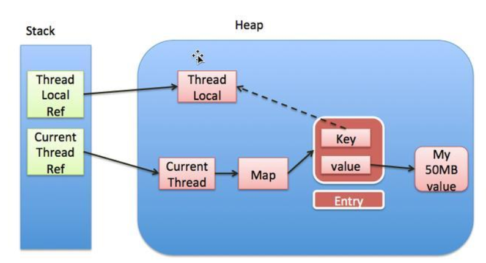

1.计算机网络 

- 典型握手分手问题
- tcp、udp头部结构、数据包长限制
- http请求过程，请求头，响应码
-  HTTP的长连接是怎么做的 

2.线程池

- 线程池工作原理

- 线程池某个任务抛出异常怎么办

- 线程池的阻塞队列有哪些(阻塞队列一般涉及锁，所以锁也是常问)

- 守护线程怎么判断线程是否结束没有结束，延期怎么延期

- 线程池参数作用

- 如何优雅的关闭线程池

  > shutdownNow:不管是否有线程在运行，立即关闭，可能会报错，使用shutdownNow关闭需要去捕获异常。
  >
  > shutdown：等待线程运行完后才能关闭，有可能无法关闭，使用shutDown关闭线程需要，检查是否有任务是永久阻塞等待的逻辑。
  >
  > shutdownNow和shutdown调用完不会立马关闭，还需要调用awaitTermination方法来阻塞等待。

3.锁

- synchronized

- volitale几个性质。内存可见，防止重排序保证有序，原子性(但是不包含i++ 可能引生 concurrent.atomic下的AtomicXXX的原子类)

- AQS

  ```
  
  ```

  

- synchronized和AQS的区别

- synchronized和lock的区别

  ```
  synchronized 是JVM带的锁，lock是JDK带的锁，lock的子类有ReentrantLock 、 ReentrantReadWriteLock 、WriteLock、ReadLock。
  
  jdk8对synchronized进行了优化，比如自旋锁。
  
  ReentranLock 可中断，synchronized不能
  
  synchronized 是非公平锁，ReentrantLock默认非公平，但是也可以是公平锁。
  
  ReentrantLock可以绑定多个Condition
  
  <font color="red">选择，如果只是使用锁的基础功能，建议使用synchronized，因为是JVM的一个锁机制，JVM原生支持，会确保释放锁。然而ReentrantLock 有可能会导致死锁的问题</font>
  ```

- ThreadLocal

  ```
  ThreadLocal为当前线程填充变量，该变量对于其他线程而言是隔离的，每个线程可以访问自己的变量副本。
  好处：
   · 在进行对象跨层传递的时候，使用ThreadLocal可以避免多次传递，打破层次间的约束
   · 线程间数据隔离
   · 进行事务操作，用于存储线程事务信息
   · 数据库连接，Session回话管理，TraceId的日志链路追踪
   Entry是继承于弱引用，如果ThreadLocal为null，会被回收，造成value内存泄漏。只要继承与弱引用的东西都会出现内存泄漏的问题，比如HashTable,解决方案就是执行完后 调用remvove或者对应的clear方法。
  ```

  ```java
  public T get() {
          Thread t = Thread.currentThread();
          ThreadLocalMap map = getMap(t);
          if (map != null) {
              ThreadLocalMap.Entry e = map.getEntry(this);
              if (e != null) {
                  @SuppressWarnings("unchecked")
                  T result = (T)e.value;
                  return result;
              }
          }
          return setInitialValue();
      }
  static class Entry extends WeakReference<ThreadLocal<?>> {
              /** The value associated with this ThreadLocal. */
              Object value;
  
              Entry(ThreadLocal<?> k, Object v) {
                  super(k);
                  value = v;
              }
          }
  ```

   

  ​     以上是ThreadLocal、Thread、ThreadLocalMap的关系

-  ArrayBlockingQueue怎么实现 (ReentrantLock+ 两个condition)

4.JVM

- 基础知识
- 几个垃圾回收器原理和垃圾回收算法
- CMS
- 如果一个固定的堆内存，当创建线程很多的时候，JVM参数怎么配置
-  JVM的最大堆内存和最小堆内村你们项目中是如何配置的，为什么配置成相等的模式 

5.基础的设计模式

6.spring

- bean的生命周期

7.跳表的插入删除过程

8.explain有哪些字段

```
table、type、possible_keys、key、key_len、ref、rows、Extra

type:

​      all：全表扫描

​	const：读常量，最多一条记录。
```


