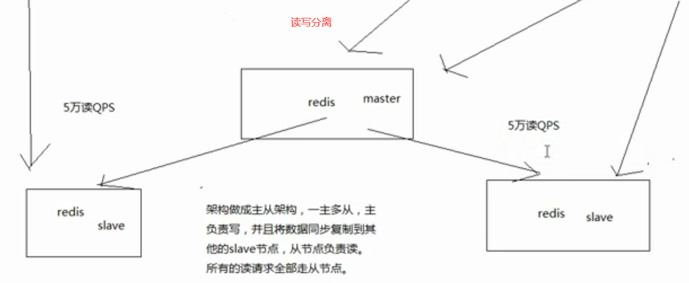

面试题：

* 在项目中缓存是如何使用的？缓存使用不当会造成什么后果？(那些地方用，为什么要用，不用行不行？用了后以后可能有什么不好的后果)。

>  1.为什么要用：高性能和高并发。高性能：有些数据在一定时间内不会改变，并且每次查询都是从mysql中查询，每次都是几百毫秒。于是使用redis缓存数据库的结果集，那么每次查询都会从缓存中拿取，速度就很快。缓存是走内存，内存天然很快，可以支撑4W/s也是没有什么问题，而数据库的一般不超过2000/s
>
> 2. 不良后果：缓存与数据库双写不一致、缓存雪崩、缓存穿透、缓存的并发竞争

#### redis和memcached的区别是什么？redis线程模型是什么？为什么单线程的redis比多线程的memcached效率高很多？(为什么redis是单线程但是可以支持高并发)

redis单线程NLO异步线程模型。

* redis比memcached的数据结构更多、操作更多、
* 简单的key-value存储，memcached的效率会更高；redis采用hash结构来说key-value，由于组合式的压缩，其内存利用率会高于memcached。
* 性能相比：redis单核，memcached是多核。redis存储小数据效率更高。
* 集群模式：memcached没有原生的集群模式，西药依靠客户端来实现往集群分片中写入数据。redis原生支持cluster模式。

redis的线程模型

* 客户端发送一个事件，redis的一个服务器socket通过io多路复用程序，然后放在一个事件队列中，在通过文件事件分离器分配给不同的事件处理器并返回响应的处理结果

为什么单线程可以支持这么高的并发

* redis的io多路复用可以同时监听几百上千个socket然而他的功能只有，监听，压进队列，速度和效率很高。然而各种事件处理器的速度和效率也很高。

> io多路复用是 非阻塞的io多路复用机制

* 纯内存的操作，内存本来就很快
* 单线程避免多线程上下文频繁切换的问题

#### redis有哪些数据类型，哪些场景使用比较合适

​	string、hash(map)：主要存储对象等、list：列表还可以通过lrange进行简单的分页、set：无序集合，自动去重、sorted set：排序队列

#### redis过期策略是什么？手写LRU

redis怎么对过期key删除的：定期删除+惰性删除。

如果惰性删除，漏掉多个过期key堆积，内存占用越来越大采用内存淘汰机制来删除。

内存淘汰：

​	redis的一些策略：最近最少使用、随机删除等

#### redis怎么保证高可用高并发

**redis如何通过读写分离来承载超10w+的QPS**

* 凡是支持高并发的架构，redis是不够的，但是redis是很重要的一个环节。首先是底层缓存能够支持我们说的那种高并发，其次再经过良好的整体的缓存架构的设计(多级缓存架构、热点缓存)。
* redis不能支持高并发的瓶颈在哪儿？ 单机redis(单机redis的QPS<5W)
* 如果redis要求超过QPS 10W+ 那应该怎么做？  读写分离，缓存一般用来支持读高并发，写的请求比较少，大量的都是读，一秒钟二十万读。采用主从架构，主master负载写，并且将数据同步到slave ，从salve就负责读，追求更高的QPS的话，那么增加响应的slave主机即可。

> 读写分离有个好处： 可以实现水平扩展

**redis replication**

replication：主从复制

redis主从架构 -> 读写分离架构 -> 可支持水平扩展的读高并发

核心机制：

* redis采用异步方式复制数据到slave节点，从redis2.8开始，slave node会周期性的确认自己每次复制的数据量。
* 一个master node 可以配置多个slave node
* slave node 也可以连接其他的 slave node
* slave node 做复制的时候，是不会阻塞的block，master node 会正常工作
* slave node 在做复制的时候，也不会block对自己的查询操作，它仍会用旧的数据提供服务，复制完成后需要删除旧数据，加载新数据，这个时候暂停对外服务
* slave node主要用来进行横向扩容，读读写分离，扩容slave node提高读的吞吐量。

master持久化对于主从架构的安全保障意义

​	采用主从架构，建议开启master node 的持久化

​	如果master宕机，重启，没得本地数据，然后主从复制，salve node的数据也会丢失 100%丢失

即使采用后续讲解的高可用机制，slave node 可以自动接管 master node，但是也可能sentinal没有检测到 master，master 就自动重启，也会导致数据清空，数据丢失。

