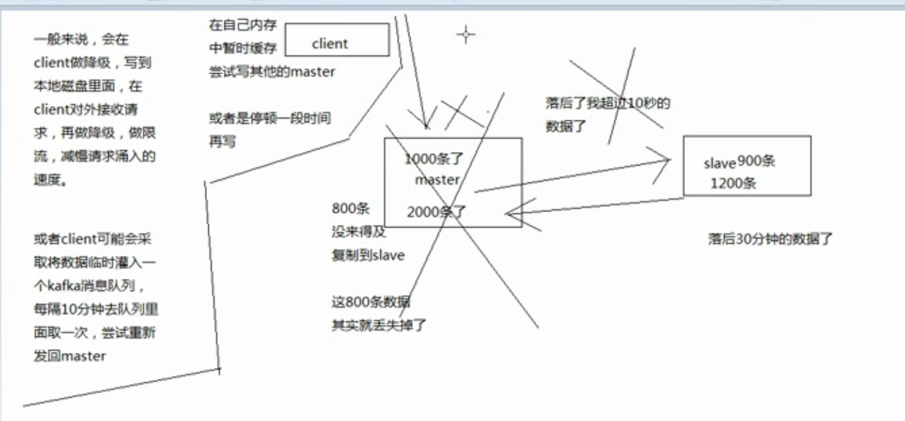

面试题：

* 在项目中缓存是如何使用的？缓存使用不当会造成什么后果？(那些地方用，为什么要用，不用行不行？用了后以后可能有什么不好的后果)。

>  1.为什么要用：高性能和高并发。高性能：有些数据在一定时间内不会改变，并且每次查询都是从mysql中查询，每次都是几百毫秒。于是使用redis缓存数据库的结果集，那么每次查询都会从缓存中拿取，速度就很快。缓存是走内存，内存天然很快，可以支撑4W/s也是没有什么问题，而数据库的一般不超过2000/s
>
> 2. 不良后果：缓存与数据库双写不一致、缓存雪崩、缓存穿透、缓存的并发竞争

#### redis和memcached的区别是什么？redis线程模型是什么？为什么单线程的redis比多线程的memcached效率高很多？(为什么redis是单线程但是可以支持高并发)

redis单线程NLO异步线程模型。

* redis比memcached的数据结构更多、操作更多、
* 简单的key-value存储，memcached的效率会更高；redis采用hash结构来说key-value，由于组合式的压缩，其内存利用率会高于memcached。
* 性能相比：redis单核，memcached是多核。redis存储小数据效率更高。
* 集群模式：memcached没有原生的集群模式，西药依靠客户端来实现往集群分片中写入数据。redis原生支持cluster模式。

redis的线程模型

* 客户端发送一个事件，redis的一个服务器socket通过io多路复用程序，然后放在一个事件队列中，在通过文件事件分离器分配给不同的事件处理器并返回响应的处理结果

为什么单线程可以支持这么高的并发

* redis的io多路复用可以同时监听几百上千个socket然而他的功能只有，监听，压进队列，速度和效率很高。然而各种事件处理器的速度和效率也很高。

> io多路复用是 非阻塞的io多路复用机制

* 纯内存的操作，内存本来就很快
* 单线程避免多线程上下文频繁切换的问题

#### redis有哪些数据类型，哪些场景使用比较合适

​	string、hash(map)：主要存储对象等、list：列表还可以通过lrange进行简单的分页、set：无序集合，自动去重、sorted set：排序队列

#### redis过期策略是什么？手写LRU

redis怎么对过期key删除的：定期删除+惰性删除。

如果惰性删除，漏掉多个过期key堆积，内存占用越来越大采用内存淘汰机制来删除。

内存淘汰：

​	redis的一些策略：最近最少使用、随机删除等

#### redis怎么保证高可用高并发

**redis如何通过读写分离来承载超10w+的QPS**

* 凡是支持高并发的架构，redis是不够的，但是redis是很重要的一个环节。首先是底层缓存能够支持我们说的那种高并发，其次再经过良好的整体的缓存架构的设计(多级缓存架构、热点缓存)。
* redis不能支持高并发的瓶颈在哪儿？ 单机redis(单机redis的QPS<5W)
* 如果redis要求超过QPS 10W+ 那应该怎么做？  读写分离，缓存一般用来支持读高并发，写的请求比较少，大量的都是读，一秒钟二十万读。采用主从架构，主master负载写，并且将数据同步到slave ，从salve就负责读，追求更高的QPS的话，那么增加响应的slave主机即可。

> 读写分离有个好处： 可以实现水平扩展

**redis replication**

replication：主从复制

redis主从架构 -> 读写分离架构 -> 可支持水平扩展的读高并发

核心机制：

* redis采用异步方式复制数据到slave节点，从redis2.8开始，slave node会周期性的确认自己每次复制的数据量。
* 一个master node 可以配置多个slave node
* slave node 也可以连接其他的 slave node
* slave node 做复制的时候，是不会阻塞的block，master node 会正常工作
* slave node 在做复制的时候，也不会block对自己的查询操作，它仍会用旧的数据提供服务，复制完成后需要删除旧数据，加载新数据，这个时候暂停对外服务
* slave node主要用来进行横向扩容，读读写分离，扩容slave node提高读的吞吐量。

master持久化对于主从架构的安全保障意义

​	采用主从架构，建议开启master node 的持久化

​	如果master宕机，重启，没得本地数据，然后主从复制，salve node的数据也会丢失 100%丢失

即使采用后续讲解的高可用机制，slave node 可以自动接管 master node，但是也可能sentinal没有检测到 master，master 就自动重启，也会导致数据清空，数据丢失。

**主从架构核心原理**

​	当启动一个slave node的时候，他会发送一个PSYNC命令给master node，然后开始full resynchronization 的时候，master后台启动一个线程，生成一个RDB快照文件，同时还会将从客户端收到的所有写命令继续缓存在内存中，RDB文件生成完成后，master会将这个RDB发送给slave，slave会先写入本地磁盘，然后再从本地磁盘加载到内存中，然后master会将内存中缓存的写命令发送给slave，slave也会同步这些数据。 全量复制

> ​	slave node 如果和master node有网络故障，断开了连接，会自动重连，master如果发现有多个slave node都来重新连接，仅仅会启动一个 rdb save操作，用一份rdb数据服务前部slave node.
>
> ​	如果slave node 重新连接master node，master 仅仅会复制给slave部分缺少的数据。如果第一次连接的话，就会触发 一次 full resynchronization

**主从复制的断点重传**

​	就是复制过程中，网络连接掉了，可以接着上次复制的地方继续复制下去，而不是从头开始复制一份。

> 断点重传，怎么记录上一次传到哪一个位置？ 肯定是日志
>
> ​	master node 会在内存中有一个常见的backlog，master 和slave 都会保存一个replica offset 开始复制，但是如果没有找到对应的offset ，那么会执行一次resynchronization

**无磁盘化复制**

​	master在内存直接创建rdb，然后发送给slave，不会自己在本地落地磁盘。

**过期key处理**

​	slave不会处理过期key，只会等待master过期key，如果master过期了一个key，或者通过LRU淘汰了一个key，那么会模拟一条del命令发送给slave

****

**复制流程**

> 1. slave node 首先会保存master node 的相关信息(host、ip)，一般在配置文件中配置的
> 2. slave的一个定时任务，会检测是否有master需要连接，如果有，就建立连接。
> 3. 请求master，并且签名校验后建立连接
> 4. master启动全量复制，将所有的数据，都异步的发送给slave，实现数据同步
> 5. 当master有新的数据写入的时候，都会异步的向slave同步数据

**数据同步的核心机制**

第一次slave和master建立连接的时候，会执行全量复制，这个过程的一些机制

1. master 、slave都会维护一个offset。 master、slave都会不断的累加offset，slave每秒都会上报自己的offset给master，同时master会保存每个slave的offset
2. backlog：master node 有一个日志 backlog，默认1M，每次给slave node复制数据的时候，会将数据在backlog中同步写一份。backlog就是在做全量复制的时候断开后的增量复制。
3. master run id ： 检测master node 的一个标识，不能用 host+ip的方式定位master node 因为如果master备份，重启的时候，host+ip检测不了数据的变化
4. psync ： 从节点使用psync从master node 进行复制，psync runid offset ， master node根据自身的响应信息，确定是全量复制还是增量复制。

**全量复制**

​	master 复制一个rdb快照

**增量复制**

​	master全量复制中断后，通过记录backlog的断点重传，就是增量复制

**heartBeat**

​	主从节点通过心跳确定相互之间有没有故障

**异步复制**

​	master每次收到写命令之后，内部写入数据，然后异步发送给slave

****

#### 哨兵介绍 sentinal

哨兵的功能：

* 集群监控，负责监控redis 的 master 、slave 是否正常工作
* 消息通知，如果某个redis实例有故障，那么哨兵负责发送消息作为报警通知给管理员
* 故障转移，如果master node挂掉了，会自动转移到slave node上
* 配置中心，如果故障转移发生了，通知client客户端新的master地址。

哨兵本身也是分布式的，作为一个哨兵集群去运行，相互协同工作

* 故障转移的时候，判断一个master node 是否死掉，需要大部分哨兵都同意才行，涉及到分布式选举问题。
* 即使部分哨兵节点挂掉了，哨兵集群还是能正常工作的。但是要避免单点故障

哨兵的必要条件

* 哨兵至少需要3个实例，来保证自己的健壮性
* 哨兵+redis主从部署架构，是不会保证数据零丢失的，只保证redis集群高可用性。
* 对于哨兵 + redis主从这种复杂的部署架构，尽量在测试环境和生产环境，能进行充足的测试

为什么redis哨兵集权只有2个节点无法工作

选举算法是大多数运行的时候才同意故障转移，但是如果只是两个的话，一个故障了，只有一个运行，就是1,1并不是大多数，所以无法完成工作。

****

**主备切换数据丢失问题**

1. 当master刚写完数据，准备异步复制数据到slave的时候，这个时候master故障，slave被选举成master node了，内存中没有来得及复制的数据就丢失了。

   

   2. 集群脑裂导致数据丢失的问题，由于网络问题，master和其他slave处于网络分区，相互之间不能相互联系，哨兵集群认为master故障，重新选举新的 master，这个时候有两个master去控制一个功能，就是脑裂。客户端和原来的master进行通讯，写入新数据。网络恢复后，原来的master会被调整成slave，那么原来写入的数据就会丢失。

   > 解决异步复制和脑裂导致的数据丢失
   >
   > min-slaves-to-write 1
   >
   > min-slave-max-lag 10 : slave复制数据和ack的延时太长，就认为master可能宕机，然后拒绝写请求，把宕机的master的数据损失降低到最小。

****

**sdown odown转换机制**

sdown odown两种失败状态

* sdown : 主管宕机，如果一个哨兵如果自己ping master ，ping不通，那么就认为这个master 宕机了
* odown：客观宕机，如果quorum数量的哨兵都觉得master 宕机了就是客观宕机。

**哨兵和slave集群的自动发现机制**

​	哨兵互相之间发现，通过redis 的 pub/sub 每个哨兵往 sentinel_:hello发送消息，其他哨兵都会订阅和消费消息来感知其他哨兵的存在，每个哨兵还会跟其他哨兵交换对master的监控配置，相互进行监控配置的同步。

**slave -> master 选举算法**

如果一个master被认为odown了，并且majority哨兵允许主备切换，为了选举哪一个slave来成为master的条件。

考虑的信息：

* 跟master断开连接的时长
* slave的优先级
* 复制 offset
* run id

会进行的排序

* 按照slave的优先级排序，slave priority 越低，优先级越高
* 如果slave priority相同，那么看replica offset ,数据复制越多，offset越靠后，优先级就越高
* 最后看run id，选择比较小的以一个 run id

****

#### redis持久化的意义

​	意义在于故障恢复

持久化方案 ： RDB 、 AOF ，他们的区别是？

> 企业级redis架构特点： 海量数据、高并发、高可用
>
> 持久化主要是做灾难恢复、数据恢复、也可以归类于高可用的环节

**RDB AOF**

* RDB持久化机制，对redis中的数据执行周期性的持久化
* AOF 持久化 ，对每条写入命令作为日志，在redis重启的时候通过回放AOF日志中的写入指令来重新构建整个数据集

> AOF是存放每条写命令的，所以会不断膨胀，当大到一定程度的时候，AOF做rewrite操作，就会基于当时redis内存中的数据，来重新构造一个更小的AOF文件，然后将旧的膨胀得很大的文件给删除掉。
>
> ​	如果同时使用RDB和AOF两种持久化机制，那么redis重启的时候，会使用AOF来构建数据，因为AOF的数据更为完整

**RDB、AOF优点**

RDB

* 优点：

  ①.RDB会生成多个数据文件，每个数据文件都代表了某一个时刻中redis的数据，这种多个数据文件的方式，适合做冷备，可以将这种完整的数据文件发送到远程的安全储备上去。

  ②.RDB对外提供读写服务，影响非常小，可以让redis保持高性能，因为redis主进程只需要fork一个子进程，让子进程执行磁盘IO进行RDB持久化。

  ③.相对于AOF持久化机制来说，直接基于RDB文件来重启和恢复redis进程更快。

* 缺点：

  ①.如果想要在redis故障时，尽可能的减少丢失数据，RDB不如AOF。一般RDB数据快照文件，都是每隔5min，但是在中途宕机，那么会丢失数据。

  ②. RDB每次在fork子进程来执行RDB快照生成的时候，数据文件会特别大，可能会导致客户端提供的数据卡顿。

AOF

* 优点：

  ①：AOF可以更好的保护数据不丢失，一般AOF会每隔1秒，通过一个后台线程执行一次fsync操作，最多丢失1s的数据。

  ②：AOF日志文件以append-only模式写入，所以没有任何磁盘寻址的开销，写入性能非常高，而且文件不会损坏，及时文件尾部破损，也很容易修复。

* 缺点：

  ①：对于同一份数据，AOF文件会更大

  ②：AOF开启后，支持的写QPS比RDB的QPS低。

**如何选择**

* 不要仅仅使用RDB，因为那么会导致你丢失很多数据
* 也不要仅仅使用AOF，会存在两个问题
* 综合使用

#### redis集群模式(cluster)的工作原理是什么？ redis 的key是如何寻址的，分布式寻址有哪些算法，了解一致性hash算法吗？

> redis cluster vs replication + sentinal
>
> * 如果数据量比较少，主要承载高并发高性能的场景，那就创建 一个 replication就可以了，一个master，多slave，要多少个slave取决于吞吐量的要求，然后自己搭建一个sentinal哨兵集群，来保证redis主从架构的高可用
> * 如果是针对于 海量数据+高并发+高可用的场景 就用redis cluster。多master 多slave，就不用application

**一致性hash算法 + redis cluster 的hash slot**

​	用不同的算法，就决定了在多个master节点的时候，数据如何分布到这些节点上去，主要是解决这个问题。

> 最老土的hash算法和弊端：
>
> ​		大量的缓存重建
>
> 一致性hash算法：
>
> ​		自动缓存迁移+虚拟节点(负载均衡)
>
> redis cluster 的hash slot算法：
>
> ​		 redis cluster 有固定的16379个hash slot,对每个key计算CRC16值，然后对16379取模，可以获取到key对应hash slot 。
>
> ​		redis cluster中每个master都有部分slot ,比如有3个master,那么可能每个master持有5000多个hash slot。hash slot 让node的增加和移除非常简单，增加一个master，就将其他master的hash slot移动部分过去，减少一个master，就将它的hash slot 移动到其他master上去。
>
> ​	移动hash slot 的成本非常低
>
> ​	客户端的api，可以指定的数据，让他们走指定的hash slot

**redis cluster**

* 自动将数据进行分片，每个master上放一部分数据
* 提供内置的高可用支持，部分master不可用时，还可以继续工作

​		在redis cluster架构下，每个redis要开放两个端口号，一个是6379，另外一个就是加10000的端口号，比如16379。16379 端口号是用来进行节点间通信的，也就是cluster bus 的东西，集群总线，cluster bus 的通信，用来进行故障检测，配置更新，故障转移授权。 cluster bus 用了另外一种二进制的协议，主要用于节点间进行高效的数据交换，占用更少的网络带宽和处理时间。

****

#### 缓存雪崩、缓存穿透怎么处理

**缓存雪崩**

就是redis宕机，所有请求直接到mysql，导致mysql挂掉。

**怎么解决缓存雪崩**

* 事前: redis 保证高可用(主从+哨兵/redis cluster集群) ，避免全盘崩溃
* 事中：在系统中用echache缓存一点数据。本地echache缓存 + hystrix限流和降级，避免Mysql被打死
* 事后：redis支持化，全量数据恢复

**缓存穿透**

大量请求 redis和mysql中都不存在的数据。但是每次都会访问mysql，最后mysql宕机

**解决方案**

* 请求过来，如果数据没有，那么把这条数据缓存下来，写进去一个空值

#### 如何保证缓存与数据库双写时的数据一致性问题

​	**最经典的缓存+数据库读写的模式：①.在读的时候，先读缓存，缓存没有的话，那么就读数据库，然后取出数据后放入缓存，同时返回响应。②. 更新的时候，更新数据库，删除缓存**

****

**高并发下的缓存和数据库双写不一致问题**

- 初级问题

  先修改数据库，再删除redis的数据，如果删除缓存失败，导致数据库缓存双写不一致。解决方案，先删除redis，再修改数据库。

  

- 稍微复杂的问题：①：删除redis数据，②: 数据库尝试去修改，③但是 在数据库还没有修改成功的时候，一个请求进redis发现，没有数据，再进去数据库查到了未被修改的数据，然后更新到redis。④这时，数据库的修改成功了。最后结果数据库缓存双写不一致。在并发比较高得情况下也会出现这个问题。在对于一个数据在并发的进行读写的时候，才可能出现这个问题。

  解决方案：①：在内存定义几个队列，通过队列控制。②：在更新数据库的时候，删除缓存后，对这个字段加锁，等到更新数据库结束的时候再释放锁。

  

****

 #### redis的并发竞争是什么？怎么解决这个问题？了解Redis的CAS方案吗

##### 并发竞争

​	在redis设置某一个key，多个客户端同时更新一个缓存key，导致修改的顺序错乱，导致最后结果错误。

​	

##### 解决方案

​	分布式锁(分布式锁：redis、zookeeper)  对那个字段进行加锁，让后面的请求通过获取锁后再进行操作，并且保存时间戳作为版本号。

****

#### 关于公司redis思考

公司架构是否主从架构？集群架构？用了那种集群方案？有没有做高可用保证？有没有开启持久化机制确保可以进行数据恢复？线上给的几个G内存，设置了那些参数。压测能够承载多少QPS?

> redis cluster ,10台机器，其中5台机器部署了master，另外5台部署slave，每个master挂载了一个实例，每个节点的QPS应该可以5W，总的5台的话，就是25W。
>
> 32G的内存+ 8GCPU。 大概常驻内存是200w数据，应该是20G。
>
> redis 内存最好不超过10G，超过10G估计会有问题。

