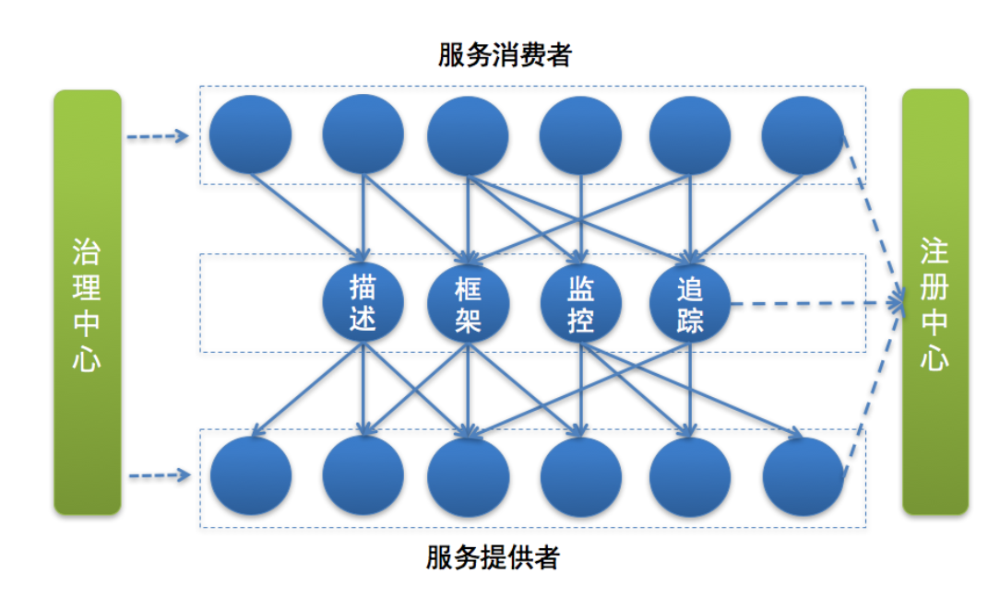
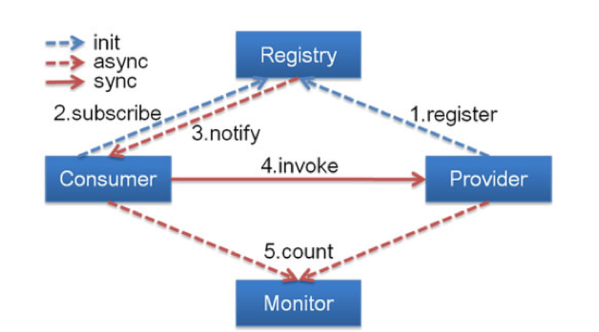
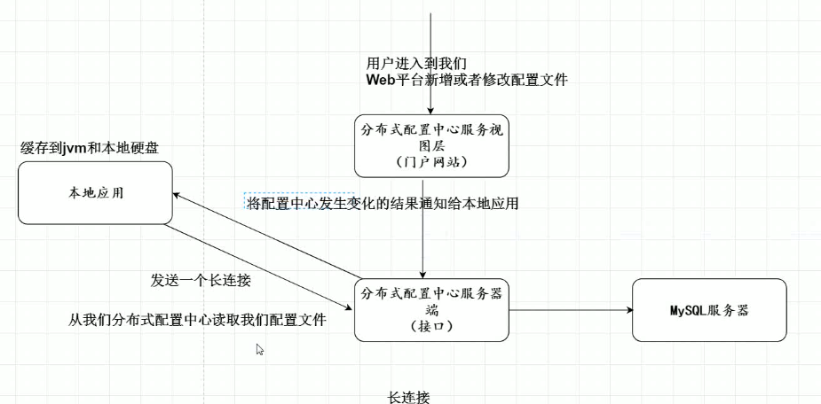
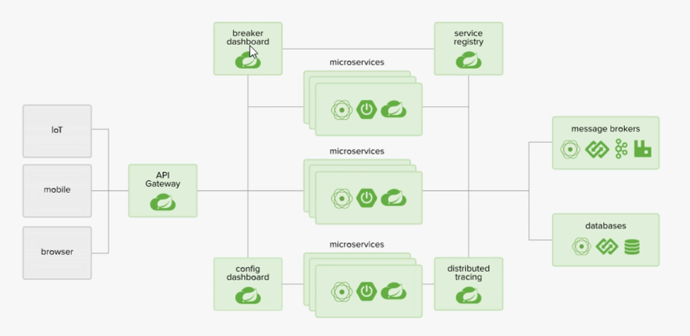

#### 服务化拆分

* 纵向拆分，从业务维度进行拆分。比如web端作为一个模块，用户端作为一个模块，等等

* 横向拆分：从公共并且独立的维度进行拆分。标准时按照公共被多个其他服务调用，并且依赖的资源独立不予其他业务耦合。

  > 比如，社交App的昵称，无论是在首页信息，评论还是消息箱，都需要显示用户昵称，如果有新的需求开发完成，那么所有模块都要进行发布。如果昵称作为独立的模块发布就不会影响其他模块。
  >
  > 但是无论怎么样都会出现耦合。



#### 微服务框架主要依赖的几个基本组件(6个)

​	注册中心(nacos-目前用的、Eureka)，网关：cloud Gateway:，Cloud Feign，Cloud Ribbon，Hystrix，Cloud Admin， XXLJob Admin, Sentinel，ELK

> Eureka 是注册中心。但是Nacos = SpringCloud 注册中心+ SpringCloud配置中心(SpringCloud Config)

- 服务描述：理解为接口文档？

- 注册中心-nacos/eureka：<font color = "red">这个组件必须，</font>服务提供者将服务登记在注册中心。

  > 一般的流程：
  >
  > ​	服务提供者在启动的时候：根据服务发布文件中配置的发布信息向注册中心注册自己的服务。
  >
  > ​	服务消费者在启动的时候：根据消费者配置文件中配置的服务信息向注册中心订阅自己所需要的的服务。注册中心会返回服务提供者地址列表给消费者。
  >
  > 

- 服务框架： 在注册中心获取地址准备调用之前。整个框架的基础内容：

  ①：服务通信是什么协议？四层tcp、udp？ 七层 http？other？

  ②：数据传输采用的方式？ 同步？异步？单连接传输？ 多路复用？

  ③：数据压缩采用的格式？ JSON序列？ java对象序列化？Protobuf序列化？

- 服务监控：就是在正常服务后，对整个框架下的服务进行监控，查看服务是否正常。

  ①：指标收集--把每次服务调用的请求耗时，成功与否等信息上传到数据处理中心。

  ②：数据处理--根据①的数据，计算每秒服务请求量、平均耗时、成功率等指标

  ③：数据展示--展示①、②的数据

- 服务追踪：方便查询故障。每次服务请求后，都会记录服务每一次调用经过的那些链路，方便后续的问题追踪，和故障定位

  > 服务消费者在发起调用前，会在本地按照一定的规则生成一个requestid，发起调用时，将requestuid作为请求参数的部分，传递给服务提供者。
  >
  > 服务器提供者接受到请求后，记录这次的请求的requestid，然后处理请求。如果服务提供者继续请求其他服务，也会在本地生成自己的requestID，然后把这两个requestid当做参数继续往下传递。

- 服务治理-netflix hystrix熔断器：主要是解决各种问题。自动摘除故障节点，自动切换IDC、熔断、限流


#### Nacos

​	nacos = 注册中心eureka + 分布式配置中心 springcloud config。所以Nacos的配置中心(前后端)和注册中心都是部署在同一个单体应用上。默认端口号 8848。

> 分布式配置中心有什么好处？
>
> ​	正常项目的配置和项目是绑定在一块的，如果配置发生变化，必然会重新发布影响线上环境。


##### 分布式配置中心原理



> 配置中心一般都是长连接。长连接的作用就是监听。
>
> 比较配置之间是否更新，通过比较 版本号|MD5

原理：

* 本地应用读取云端分布式配置中心文件。第一次连接会建立长连接。
* 读取配置文件后，缓存在JVM和硬盘中。
* 本地应用与分布式配置中心保持长连接。
* 当配置文件的版本号或者MD5发生变化，那么及时刷新本地配置文件。

Nacos的使用

​	官网下载

解压运行即可。不过需要将项目的配置文件改成bootstrap.yaml，因为bootstrap 要比 application 先加载。


##### nacos 集群

- 把每个nocos的conf中的cluster.conf 添加对应的 ip: port。 然后在项目的 nacos.service 把对应的ip+port写上，并且用 ; 隔开。

**nacos 与 eureka 的区别**

> CAP: Consistency 一致性，Availablity 可用性，Partition tolerance 分区容错性。

nacos 支持 CP/AP模式。nacos 默认是AP模式。 cp的形式 底层集群 采用raft协议保住数据一致性。

zookeeper：采用的是Cp保证数据的一致性，原理采用Zab原子广播协议，Zk选举的时候，整个服务是不可以使用的。可运行的节点必须要满足过半机制。

eureka：采用AP的模式，完全去中心化思想。没有主从之分，每个节点都是均等的，相互注册原理。只要最后有一个eureka节点就能保住微服务通信。

分布式一致性算法协议：raft、zab协议。


**********

##### Q1:什么是微服务

​		强调的是服务的大小

> 微服务架构：对微服务的各种治理工作。

##### Q2:微服务之间是如何独立通讯的

​	给予RESTful api 或者 RPC远程调用。

##### Q3:springCloud 和Dubbo有什么区别

​	Dubbo是RPC远程调用

​	springcloud是用的Restful

##### Q4:  springboot 和 springcloud ，请你谈谈对他们的理解

​	..........................

##### Q5： 什么是微服务熔断？什么是服务降级

- 微服务熔断：防止系统因为访问压力而雪崩，而暂时停止对外服务调用。
- 服务降级 ： 如果某些接口的负荷较高，返回一个简单的fallback的错误信息，让用户待会再请求，保证系统稳定性和可用性。

##### Q6: 微服务的优缺点是什么？ 说下你在项目中开发遇到的坑

- 优点：
  - 每个服务足够内聚，足够小，代码容易理解这样能聚焦一个指定的业务功能或者业务需求。
  - 开发简单、开发效率提高，一个服务可能是专一的干一件事。
  - 微服务是松耦合，具有功能意义的服务，无论在哪个阶段都是独立的。
- 缺点：
  - 微服务更多，运维压力大。
  - 分布式系统的复杂性
  - 服务间通讯成本
  - 系统依赖性
  - 数据一致性
  - 性能监控等等

##### Q7:你所知道的微服务技术栈有哪些？列举一二

- springcloud + nacos + feign + gateway + ribbon + cloud admin + XXLJob admin + sentinel + ELK

##### Q8 eureka 和zookeeper都可以提供服务的注册与发现的功能，请说说两个的区别？

​	eureka 默认是cp模式，没有主从之分，只要有一个能使用就能提供所有的服务

​	zookeeper 默认是AP，有自己的集群选举算法，必须要一般以上的节点正常工作才能正常提供服务，还有脑裂，数据不一致等问题。

##### Q9: 为什么选择springcloud作为微服务架构

- 社区热度
- 可维护性
- 学习曲线
- 整体解决方案和框架成熟度




##### 常见搭配

- 服务注册发现： eureka/nacos/zookeeper
- 服务消费者：(rest + ribbon)/feign
- 熔断器：hystrix(断路器)/ hystrix Dashboard(断路器监控)/sentinel
- 路由网关：zuul/nginx/gateway
- 分布式配置中心： springcloud config /nacos
- 消息总线 springcloud bus
- 服务链路追踪 springcloud sleuth 

> 公司使用的是： springcloud + nacos + cloud gateway + cloud feign + cloud ribbon + cloud admin + XXLJob admin + sentinel + ELK
>
> - nacos ： 集 eureka (服务的注册与发现)  + cloud config (分布式配置于)于一体，还有集群状态。优点很大
> - feign 是 整合 了ribbon + hystrix,调用形式比较优雅
> - cloud admin ： 组件监控
> - XXLJob admin :  定时器任务调度平台，定时器同意管理
> - sentinel ： 接口的限流和监控。不用hystrix ，因为hystix目前功能太初级 ，界面也很差。


> <font color="red">踩坑</font>
>
> ```
> spring cloud 的版本对应是个大坑
> Release Train  Boot Version
> Greenwich 2.1.x(可用2.1.4.RELEASE)
> Finchley 2.0.x(可用2.0.5.RELEASE)
> Edgware 1.5.x
> Dalston 1.5.x
> ```


