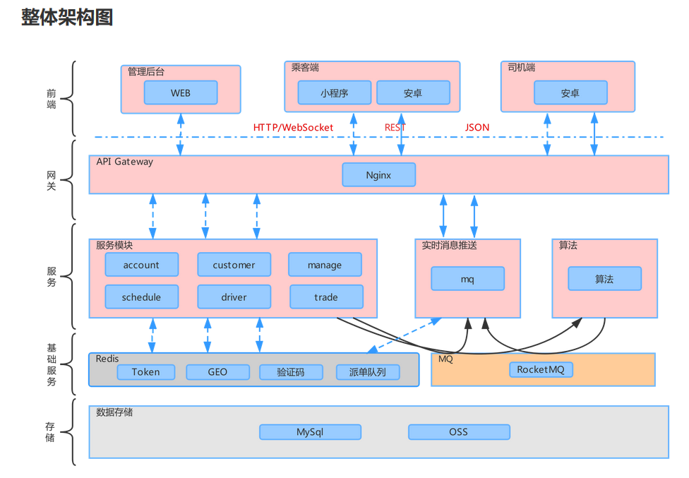
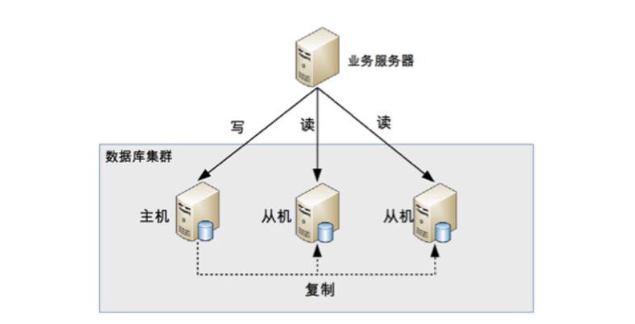
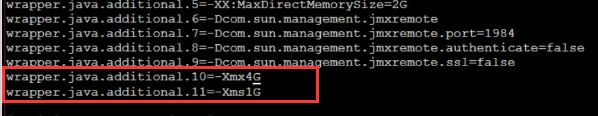
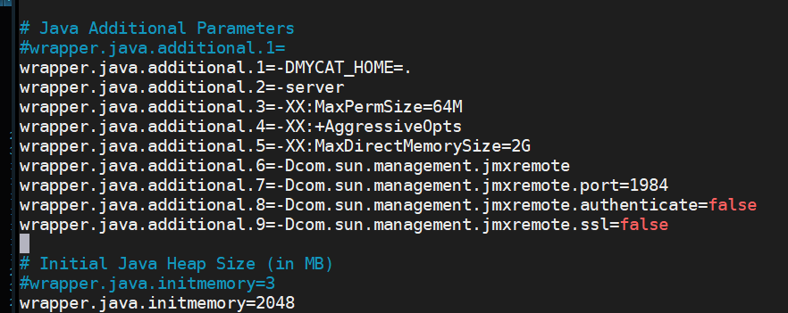

**基本准则**

- 架构设计的目的不是因为做而做，也不是因为要 **高可用**、**高性能** 、**高扩展** 的问题，架构设计的基本准则是：**为了解决软件系统复杂度带来的问题**

#### 复杂度来源

**<font color="geen">高性能</font>**

- **单台计算机**内部为了高性能带来的复杂度
- **多台计算机集群**为了高性能带来的复杂度

> 解决方案：集群，适当分多模块，或者微服务

**<font color="geen">高可用</font>**

- 系统是否**无中断** 的执行其功能的能力，代表系统的可用性程度，是进行系统设计时的准则之一。
- 系统的高可用其实就是存储的高可用(<font color="red">所以数据库的几种备份方式就比较重要了</font> ) ，但是存储高可用的难点不在于如何备份数据，而在于如何减少或者规避数据不一致对业务造成的影响。
- 分布式领域有一个CAP 定律，从理论上论证存储高可用，不可能同时满足 “一致性、可用性、分区容错性”
- 无论是计算高可用还是存储高可用，其基础都是 “**状态决策**”，即系统需要能够判断当前状态是正常还是异常，如果出现异常怎么保证高可用。如果 **状态决策** 本身都是有错误或者有偏差，其他如何完美都没有意义。

**重点和难点：无中断**

> 解决方案：**冗余** 来实现高可用的。但是也带来了复杂性。
>
>  一台机器不够就两台，两台不够就四台；一个机房可能断电，那就部署两个机房；一条通道可能故障，那就用两条，两条不够那就用三条（移动、电信、联通一起上） 。

<font color="blue"> 高性能增加机器目的在于 “扩展” 处理性能，高可用增加机器目的是在于"冗余"处理单元。</font>


**关于状态决策**

1.独裁式：独立的决策主体，存在单点故障

2.协商式：常用就是 主备策略。存在的问题：在两台机器出现信息交换问题，此时决策应该怎么做。

比如：

​		如果备机连接中断的情况下认为主机故障，那么备机成主机，但是如果主机没有故障，此时出现两个主机了。

​		如果备机连接中断的情况不认为是主机故障，那么如果真发生故障，那么就没得主机了。

很多为解决上面的问题，带入了多连接的策略，但是也是减少这种影响，但是引入新的问题，如果这几个连接收到的信息不一致，那么我该选择那一条连接的数据呢，感觉无解。


3.民主式：通过多个独立的个体投票的方式进行状态决策。Zookeeper集群就是选举leader采用的这种方式。存在的问题：脑裂，两个独立分隔的子集群，每个集群单独进行选举，于是选择出2个主机，相当于两个大脑了


<font color="geen">**可扩展性**</font>

**基本条件** 

- **正确预测变化**
- **完美封装变化**

复杂性：不能每个设计点都考虑可扩展性、不能完全不考虑可扩展性、所有的预测都存在出错的可能性。

> 解决方案： 封装变化，隔离不变


<font color="geen">**低成本、安全和规模 **</font>

- 低成本：就是想花少钱。解决方式：引入新技术或者创造新技术
- 安全： 互联网系统的架构安全目前并没有太好的设计手段来实现，更多地是依靠运营商或者云服务商强大的带宽和流量清洗的能力 
- 规模：数据库分表分库，怎么处理分库分表引起查询的问题


#### 架构设计三原则

- 合适原则：合适优于业界领先
- 简单原则：简单优于复杂
- 演化原则：演化优于一步到位


#### 识别复杂度

​	假如一天消息产生 1000万条，各个子系统产生1000万条消息，10个子系统就是 1个亿。关注不应该一天的数据，而是1秒的数据，即TPS，QPS,按照每秒计算，一天内平均写入消息是115条，每秒读取消息是1150 条；系统的读写并不是平均的，设计目标是以峰值来计算，峰值一般是 **平均值3倍**  ,那么系统的 Tps应该是345， QPS 是3450。

​	但是按照可扩展性来考虑，为后续需求要设计性能余量，一般将目标设计为峰值 **4倍** ，因此最终性能要求是： TPS:1380,QPS: 13800。

<font color="blue">最终目标可以是2-8倍，按照具体业务估算，但是不要设定在10倍以上。</font>

> 常见的系统性能量别： nginx负载均衡性能是3万左右，mc的读取性能5万左右，kafka号称百万级，zookeeper写入读取2万以上，http请求访问大概在2万左右 

> tips:架构日志占了20%的cpu，采用方案：日志压缩，采样，隔离


#### 设计备选方案

<font color="red">成熟的架构师需要对已经存在的技术非常熟悉，对已经验证的架构模式烂熟于心，然后根据自己对业务的理解，挑选合适的架构模式进行组合，再对组合的方案进行修改和调整。</font>


>  笔记 ：<font color="drakGray">所以①：架构师对现在已经存在的技术非常熟悉，这就是看源码的重要要从 **框架、性能、可用、扩展性**的角度去看 或者是**算法**。②：对于已经验证的架构模式烂熟于心，那么最基本的 **设计模式** 必须要会</font>


常见的成熟技术：  **高可用的主备方案、集群方案，高性能的负载均衡、多路复用，可扩展的分层、插件化 **

>  ZooKeeper  、  Keepalived  、 Memcache 缓存 、 Netty  


高性能数据库集群，第一种方式是读写分离，其本质是将访问压力分散到集群中的多个节点上，但是没有分散存储压力；第二种方式是“分库分表” 既可以分散存储压力又分散访问压力。

#### 数据库集群-读写分离



**步骤**

​	1.数据库搭建主从集群，一主一从、一主多从都可以。

​	2.数据库主机负责读写操作，从机只负责读操作。

​	3.数据库主机通过复制数据同步到从机，每台数据库服务都存储了所有的业务数据。

​	4.业务服务器写操作 发送给数据库主机，将读操作发送给数据库从机。

**难点**

①：主从复制延迟

> 解决主从复制延迟的几种常见方法：①：写操作后的读操作指定发给数据库主服务器(对业务侵入性和音响较大，容易出bug)。②：读从机失败后再读一次主机，二次读取，遇到黑客暴力破解，会导致主机崩溃。③：关键业务读写全部指向主机，非关键业务采用读写分离

②：分配机制


#### 数据库集群-分库分表

分库分表会带来的问题：

分库： 

​		①：join操作问题，如果分库，在同一个数据库中的表分散到不同的数据库中，导致无法SQL的join查询。

​		②：事务问题，不在同一个 数据库自然用不到数据库的事务，事务需要自己控制。

​		③：成本问题，分库用的机器会增多。

分表：

垂直分表

​		 操作表增多

水平分表

​		①：路由，由于分表后，每个表都有完整的列，那么就要判断要查询的数据在那个表中，需要增加路由算法来确定在那张表。

> 常见路由算法：范围路由(按照某一个范围进行分表，一般建议分段在 100w-2000w之间，缺点是有可能导致分表不均匀)、Hash路由(选取某个列的值进行Hash运算，能分布均匀，但是每次分表都会重分布)，配置路由( 用一张独立的表来记录路由信息 )。


#### Mycat

1.首先去官网下载对应的安装包：

```
http://www.mycat.io/
```

2.解压到自己的虚拟机或者服务器,比如路径是 usr/local/mycat

>---bin :存储的一下运行的脚本，集群相关的也在这里
>
>--- catlet   放组件的地方
>
>---conf	各种配置文件存放的地方
>
>--- lib   mycat使用的jar存放的位置
>
>---logs  日志文件夹
>
>---version.txt  版本信息

3.在conf文件夹下的wrapper.conf 配置文件，需要根据机器设置内存占用



> 默认：
>
> wrapper.java.additional.10=Xmx4G
>
> wrapper.java.additional.11=Xms1G
>
> 改小 ： 1G 、512M
>
> 不过下载的最新版本好像没有这两个参数
>
> 


schema.xml


```xml
<?xml version="1.0"?>
<!DOCTYPE mycat:schema SYSTEM "schema.dtd">
<mycat:schema xmlns:mycat="http://org.opencloudb/">

	<!-- 数据库 称为逻辑数据库 name 数据库名称， -->
	<schema name="TESTDB" checkSQLschema="false" sqlMaxLimit="100">
		<!-- auto sharding by id (long) -->
		<!-- 数据库的表信息 rule 是rule.conf 配置文件中，分表的策略，自己需要不同的分表，需要自己去配置-->
		<table name="travelrecord" dataNode="dn1,dn2,dn3" rule="auto-sharding-long" />

		<!-- global table is auto cloned to all defined data nodes ,so can join 
			with any table whose sharding node is in the same data node -->
		<table name="company" primaryKey="ID" type="global" dataNode="dn1,dn2,dn3" />
		<table name="goods" primaryKey="ID" type="global" dataNode="dn1,dn2" />

		<!-- random sharding using mod sharind rule -->
		<table name="hotnews" primaryKey="ID" dataNode="dn1,dn2,dn3"
			rule="mod-long" />
		<!-- <table name="dual" primaryKey="ID" dataNode="dnx,dnoracle2" type="global" 
			needAddLimit="false"/> <table name="worker" primaryKey="ID" dataNode="jdbc_dn1,jdbc_dn2,jdbc_dn3" 
			rule="mod-long" /> -->
		<table name="employee" primaryKey="ID" dataNode="dn1,dn2"
			rule="sharding-by-intfile" />
		<table name="customer" primaryKey="ID" dataNode="dn1,dn2"
			rule="sharding-by-intfile">
			<childTable name="orders" primaryKey="ID" joinKey="customer_id"
				parentKey="id">
				<childTable name="order_items" joinKey="order_id"
					parentKey="id" />
			</childTable>
			<childTable name="customer_addr" primaryKey="ID" joinKey="customer_id"
				parentKey="id" />
		</table>
		<!-- <table name="oc_call" primaryKey="ID" dataNode="dn1$0-743" rule="latest-month-calldate" 
			/> -->
	</schema>
	<!-- <dataNode name="dn1$0-743" dataHost="localhost1" database="db$0-743" 
		/> -->
	<!-- dataNode 是真实的数据库 -->
	<dataNode name="dn1" dataHost="localhost1" database="db1" />
	<dataNode name="dn2" dataHost="localhost1" database="db2" />
	<dataNode name="dn3" dataHost="localhost1" database="db3" />
	<!-- <dataNode name="jdbc_dn1" dataHost="jdbchost" database="db1" /> <dataNode 
		name="jdbc_dn2" dataHost="jdbchost" database="db2" /> <dataNode name="jdbc_dn3" 
		dataHost="jdbchost" database="db3" /> -->
	<!-- 真是数据库的地址 -->
	<!-- 参数含义： -->
	<!-- name：唯一标识dataHost标签，供上层调用 -->
	<!-- maxcon 指定每个读写实例连接池的最大连接 -->
	<!-- mincon 指定每个读写实例连接池的最小连接，初始化连接池大小 -->
	<!-- balance 负载均衡类型，目前取值有4种。0-不开启读写分离机制，所有读操作都发送到当前可用的writeHost上 -->
	<!-- 1-全部的readHost与stand by writeHost(非主非从)参与select 语句的负载均衡。 -->
	<!-- 2-所有的读操作，随机在writeHost、readHost上分发 -->
	<!-- 3-所有读请求随机的分发到writeHost对应的readHost执行，writeHost不负担读压 writeType 1 writeType 0,所有写都在writeHost上  -->
	<!-- dbType 数据库类型 -->
	<!-- dbDriver 数据库使用的驱动，目前可选native、jdbc -->
	<!-- switchType -1-表示不主动切换，1-默认值表示自动切换，2-基于Mysql主从同步状态决定是否切换心跳语句为 show slave status -->
	<!--  			 3-基于mysql galary luster的切换机制(适合集群) 心跳语句 show status like `wsrep%` -->
	<dataHost name="localhost1" 
		maxCon="1000" 
		minCon="10" 
		balance="0"
		writeType="0" 
		dbType="mysql" 
		dbDriver="native" 
		switchType="1"  
		slaveThreshold="100">
		<!-- 默认的心跳语句，用来检测主从之间连接是否成功 -->
		<heartbeat>select user()</heartbeat>
		<!-- can have multi write hosts -->
		<!-- weight 权重，配置在readHost中作为读节点的权重 -->
		<!-- usingDecrypt 是否对密码加密 -->
		<writeHost host="hostM1" url="localhost:3306" user="root"
			password="123456">
			<!-- 读写分离 writeHost一般是主机，readHost一般是从机 -->
			<!-- can have multi read hosts -->
			<readHost host="hosts2" url="192.168.1.200:3306" user="d" password="dd" />
		</writeHost>
		<writeHost host="hostS1" url="localhost:3316" user="root"
			password="123456" />
		<!-- <writeHost host="hostM2" url="localhost:3316" user="root" password="123456"/> -->
	</dataHost>
	<!-- <dataHost name="oracle1" maxCon="1000" minCon="1" balance="0" writeType="0" 
		dbType="oracle" dbDriver="jdbc"> <heartbeat>select 1 from dual</heartbeat> 
		<connectionInitSql>alter session set nls_date_format='yyyy-mm-dd hh24:mi:ss'</connectionInitSql> 
		<writeHost host="hostM1" url="jdbc:oracle:thin:@127.0.0.1:1521:nange" user="base" 
		password="123456" > </writeHost> </dataHost> <dataHost name="jdbchost" maxCon="1000" 
		minCon="1" balance="0" writeType="0" dbType="mongodb" dbDriver="jdbc"> <heartbeat>select 
		user()</heartbeat> <writeHost host="hostM" url="mongodb://192.168.0.99/test" 
		user="admin" password="123456" ></writeHost> </dataHost> <dataHost name="sparksql" 
		maxCon="1000" minCon="1" balance="0" dbType="spark" dbDriver="jdbc"> <heartbeat> 
		</heartbeat> <writeHost host="hostM1" url="jdbc:hive2://feng01:10000" user="jifeng" 
		password="jifeng"></writeHost> </dataHost> -->

	<!-- <dataHost name="jdbchost" maxCon="1000" minCon="10" balance="0" dbType="mysql" 
		dbDriver="jdbc"> <heartbeat>select user()</heartbeat> <writeHost host="hostM1" 
		url="jdbc:mysql://localhost:3306" user="root" password="123456"> </writeHost> 
		</dataHost> -->
</mycat:schema>

```


server.xml

```xml
<!DOCTYPE mycat:server SYSTEM "server.dtd">
<mycat:server xmlns:mycat="http://org.opencloudb/">
	<system>
	<property name="defaultSqlParser">druidparser</property>
	<!-- <property name="nonePasswordLogin">0</property> --> <!-- 0为需要密码登录，默认为0，设置1则需要制定默认账户 -->
    <!--  <property name="useCompression">1</property>--> <!--1为开启mysql压缩协议-->
	<!-- <property name="processorBufferChunk">40960</property> -->
	<!-- 
	<property name="processors">1</property> 
	<property name="processorExecutor">32</property> 
	 -->
		<!--默认是65535 64K 用于sql解析时最大文本长度 -->
		<!--<property name="maxStringLiteralLength">65535</property>-->
		<!--<property name="sequnceHandlerType">0</property>-->
		<!--<property name="backSocketNoDelay">1</property>-->
		<!--<property name="frontSocketNoDelay">1</property>-->
		<!--<property name="processorExecutor">16</property>-->
		<!-- 
			<property name="mutiNodeLimitType">1</property> 0：开启小数量级（默认） ；1：开启亿级数据排序
	    	<property name="mutiNodePatchSize">100</property> 亿级数量排序批量
			<property name="processors">32</property> <property name="processorExecutor">32</property> 
			<property name="serverPort">8066</property> <property name="managerPort">9066</property> 
			<property name="idleTimeout">300000</property> <property name="bindIp">0.0.0.0</property> 
			<property name="frontWriteQueueSize">4096</property> <property name="processors">32</property> -->
	</system>
	<user name="test"><!--  配置用户信息 -->
		<property name="password">test</property>
		<property name="schemas">TESTDB</property>

		<!-- 表级 DML权限设置 dml对应的是 增删改查-->
		<!-- <privileges check = "false">
			<schemas name="TESTDB" dml="0110"> 
				<table name="tb01" dml="0000"></table>
				<table name="tb02" dml="1111"></table>
			</schemas>
		</privileges> -->
	</user>

	<user name="user">
		<property name="password">user</property>
		<property name="schemas">TESTDB</property>
		<property name="readOnly">true</property>
	</user>
	<!-- <cluster> <node name="cobar1"> <property name="host">127.0.0.1</property> 
		<property name="weight">1</property> </node> </cluster> -->
	<!-- <quarantine> <host name="1.2.3.4"> <property name="user">test</property> 
		</host> </quarantine> -->

</mycat:server>
```


```
next value for MYCATSEQ_GLOBAL
```


单数据库单表的时候，我们使用表Id的自增，不用考虑Id的增长情况，但是，分库分表必须要考虑这个情况，例如，insert一个值，mycat帮我们将这个值存在某一个库里，判断的方式，根据Id来判断的话，当前是没有Id信息的，所以在插入的时候 要写 **next value for MYCATSEQ_GLOBAL**  表示下一个主键的值，该配置在 **/conf/equence_conf.properties**  


sequence_conf.properties

```shell
#default global sequence
GLOBAL.HISIDS=
GLOBAL.MINID=10001  # 下一个主键值
GLOBAL.MAXID=20000  # 最大值
GLOBAL.CURID=10000	# 当前

# self define sequence
COMPANY.HISIDS=
COMPANY.MINID=1001
COMPANY.MAXID=2000
COMPANY.CURID=1000

CUSTOMER.HISIDS=
CUSTOMER.MINID=1001
CUSTOMER.MAXID=2000
CUSTOMER.CURID=1000

ORDER.HISIDS=
ORDER.MINID=1001
ORDER.MAXID=2000
ORDER.CURID=1000

HOTNEWS.HISIDS=
HOTNEWS.MINID=1001
HOTNEWS.MAXID=2000
HOTNEWS.CURID=1000

```


#### 高性能No SQL(Not Only SQL)

关系型数据库拥有强大的SQL功能，和ACID的属性，但是是有如下缺点：

- 关系数据库存储的是行记录，无法存储数据结构。
- 关系数据库的 schema 扩展很不方便。RDB的表结构schema是强约束，操作不存在的列会报错，业务变化时扩充列也比较麻烦，需要使用DDL，语句修改，而且修改时可能会长时间锁表。
- 关系数据库在大数据场景下I/O较高。如果进行一些大量数据的表进行统计之类的计算，关系型数据库的I/O会很高，因为即使只针对于其中某一列进行运算，关系数据库也会将整行数据从存储设备读入内存。
- 关系数据库的全文搜索功能比较弱。关系数据库的全文搜索只能使用like进行整表扫描匹配，性能非常低，在互联网的场景下无法满足业务。


常见NoSQL解决方案：

- K-V存储：解决关系数据库无法存储数据结构的问题，以Redis为代表。优点：具有多种数据结构，性能高。缺点：并不支持完整的ACID事务，redis的事务只能保证隔离性和一致性IC，无法保证原子性和持久性AD。
- 文档数据库：解决关系数据库强schema约束的问题，以MongoDB为代表。 文档数据库最大的特点就是 no- schema， 可以存储和读取任意的数据。目前绝大部分文档数据库存储的数据格式是JSON。 优点：① 新增字段简单，不需要像关系数据库一样先执行DDL语句。②：历史数据不会出错，对于历史数据，及时没有新增的字段，也不会导致错误，只会返回空值。 ③：可以很容易存储复杂数据。缺点：不支持事务、无法实现关系数据库的join操作。
- 列式数据库：解决关系数据库大场景下的I/O问题，以HBase为代表。优点：节省大量I/O，列式数据库的压缩率比较高
- 全文搜索引擎：解决关系数据库的全文搜索性能问题，以Elasticsearch。其原理称为 “倒排序索引”，也常称为反向索引，置入档案或反向档案，是一种索引方法。


#### 高性能缓存架构设计要点

​	缓存的引入就是为了弥补存储系统早这些复杂业务场景下的不足，基本原理是将可能重复使用的数据放在内存中，一次生成，多次使用，避免每次使用都去访问存储系统。

​	缓存能够大大减轻存储系统的压力，但同时也给架构引入了更多复杂性，架构设计时如果没有针对缓存的复杂性进行处理，某些场景会导致整个系统崩溃


**缓存穿透**

<font color="blue">出现方式：</font> 缓存没有发挥作用，业务系统虽然去缓存查询数据，单缓存总没有数据，那么就去存储系统中查询数据，情况分为两种：

​		①：<font color="red">存储数据不存在</font>：正常情况下，业务读取不存在的数据请求量一般不会太大，但是黑客攻击，造大量不存在的数据访问，就会把存储系统拖垮。<font color="orange">解决方案：如果查询没有找到，就在缓存中存入这个默认值(比如空值)，二次访问的时候就不会访问存储系统了</font>  

​		②：<font color="red">缓存数据生成耗费大量时间或者资源：</font> 存储在存储系统中存在的数据，生成缓存需要耗费较长的时间或者耗费大量资源。如果刚好在业务访问的时候缓存失效了，访问压力全部集中在存储系统上的情况。比如电商的商品分页。

**缓存雪崩**

​		<font color="blue">出现方式：</font> 缓存失效后引起系统性能急剧下降的情况。当缓存过期被清楚后，业务系统需要重新生成缓存，因此需要再次访问存储系统，再次进行运算，这个处理步骤耗时几十毫秒-几百毫秒，但是在高并发环境下，就可能有一万个请求，由于旧的被清楚，新的还没有来，每个请求不知道另外一个线程在生成，那么都会去生成缓存，然后就会造成雪崩效应，系统压力剧增，宕机 ，崩溃 也有可能。

​		<font color="orange">解决方式: **更新锁机制**或者**后台更新机制**</font>，**更新锁机制**：对缓存更新加锁，保证一个线程能够进行缓存更新， 未能获取更新锁的线程要么等待锁释放后重新读取缓存，要么就返回空值或者默认值 ，分布式集群的业务系统，就使用分布式锁，比如ZooKeeper。

​		**后台更新**： 由后台线程来更新缓存，而不是由业务线程来更新缓存，缓存本身的有效期设置为永久，后台线程定时更新缓存 。

>  <font color="red">特殊情况: : 当缓存系统内存不够用，会踢掉一下缓存数据，从缓存被 踢掉，到下一次定时更新缓存的这段时间内，业务线程读取缓存返回空值，而业务线程又不会去更新缓存，因此业务上看数据是丢失的状态：解决方案：①:后台频繁的去读取缓存，发现被踢就更新缓存。有时候缓存更新不及时，用户体验一般。②：业务线程发现缓存失效后：通过消息队列发送一条消息通知后台线程更新缓存，后台线程收到消息就判断缓存存不存在，存在就不更新，反之更新。缓存更新及时，用户体验很好</font>
>
>  
>
> 还要一个策略：使用双key机制，key的设置过期时间，key1不设置过期时间，如果key不存在，返回key1的内容，然后触发一个事件更新。

**缓存热点**

​		<font color="blue">出现方式：</font>  虽然缓存系统本身的性能比较高，但对于一些特别热点的数据，如果大部分甚至所有的业务请求都命中同一份缓存数据，则这份数据所在的缓存服务器的压力也很大。例如，某明星微博发布“我们”来宣告恋爱了，短时间内上千万的用户都会来围观。 

​		 <font color="orange">解决方式: </font> 缓存热点的解决方案就是复制多份缓存副本，将请求分散到多个缓存服务器上，减轻缓存热点导致的单台缓存服务器压力。以微博为例，对于粉丝数超过 100 万的明星，每条微博都可以生成 100 份缓存，缓存的数据是一样的，通过在缓存的 key 里面加上编号进行区分，每次读缓存时都随机读取其中某份缓存 .


>  缓存副本设计有一个细节需要注意，就是不同的缓存副本不要设置统一的过期时间，否则就会出现所有缓存副本同时生成同时失效的情况，从而引发缓存雪崩效应。正确的做法是设定一个过期时间范围，不同的缓存副本的过期时间是指定范围内的随机值 


