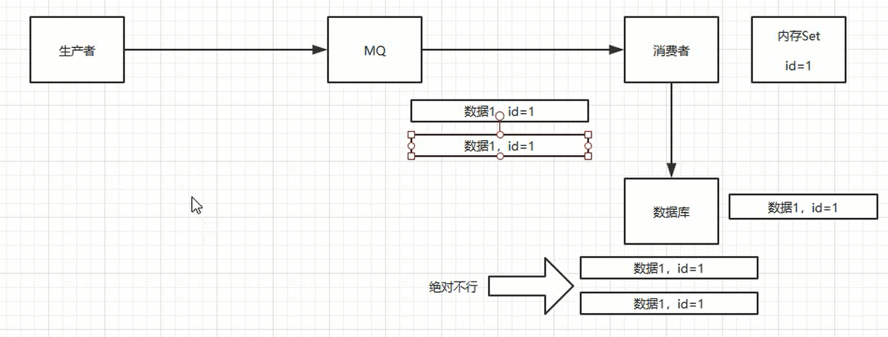
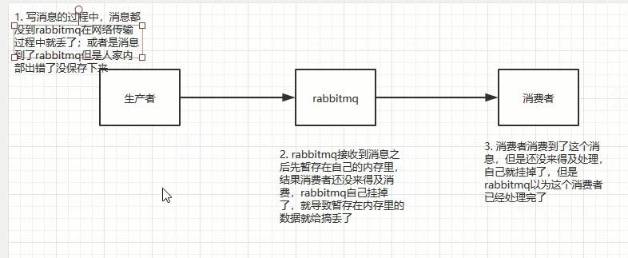

### 消息队列什么时候会重复

### 重复后怎么保证幂等性

### 如何保证消息的可靠性传输(如何处理消息丢失)

丢失数据一般分为两种：

​				①：生产者发送后，在网络传输中丢失。

​				②：mq自己搞丢的，MQ接受消息后，在MQ自己挂掉了，消息丢失。

​				③：我们消费的时候弄丢的

解决方案：

一、生产者丢失：①：使用Mq的事务功能，发生消息成功失败都会返回一个结果。但是会导致降低吞吐量。 ②： 把channel设置成confirm，然后发送消息，发送完消息就不用管了，如果接受到消息，会通知本地接口说明消息收到，如果报错，会报错。会有一个成功失败的回调。这个针对于rabbitMq。对于rocketMq是检测 SendStatus，如果是NO，那么会进行重发。

二、MQ-Broker自己挂掉：集群、消息持久化到磁盘中去。

三、消费者丢失消息：持久化offset

### 怎么保证消息的顺序性

导致顺序错乱的场景：①：一组消息，多个消费者。②：或者一组消息，一个消费者，内部多个线程。

保证消息是否有序：保证一个发，一个接受，并且只有一个队列。
